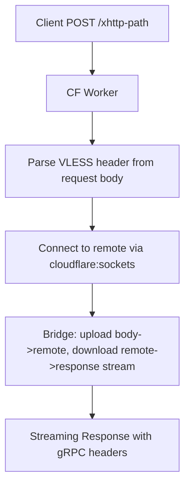

# Add HTTPX (XHTTP) Transport Support to BPB Worker Panel

## Overview

HTTPX (also called XHTTP in xray-core) is a transport that uses standard HTTP POST requests for upload and streaming HTTP responses for download, instead of WebSocket. This allows it to work through Cloudflare's gRPC feature (which requires enabling gRPC in the Cloudflare dashboard). The reference implementations are from two repos, but the BPB project needs a **direct** XHTTP handler (like the `httpx` example at `C:\projects\_vpn\httpx\index.js`) since BPB's worker IS the xray backend, not a proxy to a backend.

## Key Differences from WS

- **WS (current)**: Uses WebSocket upgrade (`Upgrade: websocket`). Data flows bidirectionally through a WebSocket.
- **XHTTP**: Uses HTTP POST for upload (client sends vless data in request body) and streaming HTTP response for download (server streams vless response back). No WebSocket involved. The response uses `Content-Type: application/grpc` headers to pass through Cloudflare's gRPC proxy.

## Architecture



## Changes Required

### 1. New file: `src/protocols/xhttp/handler.ts` — XHTTP Protocol Handler

Port the `handle_xhttp` logic from `C:\projects\_vpn\httpx\index.js` into TypeScript, adapted to BPB's patterns:

- **VLESS header parser**: Reuse the existing `parseVlHeader` logic from `src/protocols/websocket/vless.ts` but adapt it for ReadableStream (request body) instead of WebSocket frames
- **Trojan header parser**: Add support for trojan-over-xhttp (parse `parseTrHeader` from `src/protocols/websocket/trojan.ts`)
- **Dial & connect**: Use `cloudflare:sockets` `connect()` to reach the remote destination (with proxyIP fallback, same as WS)
- **Upload stream**: Pipe request body (ReadableStream) to the remote socket writable
- **Download stream**: Create a TransformStream that prepends the vless/trojan response header, then pipes remote readable through it
- **Response headers**: `Content-Type: application/grpc`, `X-Accel-Buffering: no`, `Cache-Control: no-store`, `Connection: Keep-Alive`, `User-Agent: Go-http-client/2.0`, plus optional `X-Padding`
- **X-Padding**: Add `xPaddingRange` setting (default `"100-1000"`) for random X-Padding response header

### 2. New file: `src/protocols/xhttp/common.ts` — XHTTP Common Utilities

- `parseVlHeaderFromStream(reader)` — read VLESS header from a ReadableStream reader (adapted from the httpx example's `read_vless_header`)
- `parseTrHeaderFromBuffer(buffer)` — read trojan header from a buffer
- `readAtleast(reader, n)` — read at least N bytes from a reader
- `concatTypedArrays(...)` — concatenate Uint8Arrays
- `randomPadding(range)` — generate random X-Padding value
- Shared proxyIP/fallback logic similar to WS (reuse `handleTCPOutBound` pattern)

### 3. Modify: `src/worker.ts` — Route XHTTP Requests

Add a new route before the WebSocket check for XHTTP POST requests:

```typescript
// After init(), before the websocket check:
if (request.method === 'POST' && isXhttpPath(pathName)) {
    initXhttp(env);
    return await handleXhttp(request);
}
```

### 4. Modify: `src/common/init.ts` — Add XHTTP Config

- Add `xhttpConfig` to `globalThis` with:
  - `xhttpPath`: the URL path for XHTTP transport
  - `xPaddingRange`: padding range string
  - `proxyIPs`, `proxyMode`, `prefixes` (reuse WS config patterns)
- Add `XHTTP_PATH` env variable support

### 5. Modify: `src/types/global.d.ts` — Add Types

- Add `XhttpConfig` interface (similar to `WsConfig`)
- Add `XHTTP_PATH` and `XPADDING_RANGE` to `Env` interface
- Add `xhttpConfig`, `xhttpSettings` to globalThis

### 6. Modify: `src/types/xray.d.ts` — Add XHTTP Transport Type

- Add `"xhttp"` to `TransportType` union
- Add `XhttpSettings` interface:
  ```typescript
  export interface XhttpSettings {
    mode: "stream-one" | "stream-up" | "packet-up";
    path: string;
    host?: string;
    noGRPCHeader?: boolean;
    keepAlivePeriod?: number;
  }
  ```
- Add `xhttpSettings` to `StreamSettings`

### 7. Modify: `src/cores/xray/outbounds.ts` — Build XHTTP Outbounds

- Add `buildXhttpOutbound()` function similar to `buildWebsocketOutbound()` but with `network: "xhttp"` and `xhttpSettings` in stream settings
- Add `xhttp` case in `buildTransport()`

### 8. Modify: `src/cores/xray/configs.ts` — Generate XHTTP Configs

- Add an XHTTP config generation path (similar to how WS configs are built per address/port)
- XHTTP configs will be generated alongside WS configs for each protocol (vless/trojan) and port pair
- Add a settings toggle `xhttpConfigs: boolean` (default `true`)

### 9. Modify: `src/common/init.ts` — New Settings Defaults

- Add to `Settings` defaults:
  - `xhttpConfigs: true` (enable XHTTP subscription configs)
  - `xPaddingRange: "100-1000"` (X-Padding range)

### 10. Modify: `src/kv.ts` — Persist New Settings

- Add `xhttpConfigs` and `xPaddingRange` to the `fields` array in `updateDataset()`

### 11. Modify: `tsconfig.json` — Add Path Alias

- Add `"@xhttp": ["./src/protocols/xhttp/handler"]` to paths

## XHTTP Path Convention

The XHTTP path will reuse the same WebSocket path encoding convention. The WS path currently encodes protocol/mode/panelIPs in base64 in the URL path. For XHTTP, we'll use a similar approach but with a distinct entry point (e.g., the first path segment will be `xhttp` or a configurable `XHTTP_PATH` env var, defaulting to a random UUID-based path).

The XHTTP response format mimics gRPC to leverage Cloudflare's gRPC proxy support:

```
POST /<xhttp-path> HTTP/1.1
Content-Type: application/grpc
...

HTTP/1.1 200 OK
Content-Type: application/grpc
X-Accel-Buffering: no
X-Padding: <random>
...streaming body...
```

## Client Config (Xray)

The xray client config for XHTTP looks like:

```json
{
  "streamSettings": {
    "network": "xhttp",
    "xhttpSettings": {
      "mode": "stream-one",
      "path": "/<path>",
      "host": "<hostname>",
      "noGRPCHeader": false,
      "keepAlivePeriod": 300
    }
  }
}
```

## Files Changed (Summary)

| File | Action |
|------|--------|
| `src/protocols/xhttp/handler.ts` | **NEW** - VLESS/Trojan over XHTTP handler |
| `src/protocols/xhttp/common.ts` | **NEW** - XHTTP utilities (header parsing, padding, etc.) |
| `src/worker.ts` | **MODIFY** - Add XHTTP POST route |
| `src/common/init.ts` | **MODIFY** - Add XHTTP settings, initXhttp() |
| `src/types/global.d.ts` | **MODIFY** - Add XhttpConfig, XHTTP env vars |
| `src/types/xray.d.ts` | **MODIFY** - Add xhttp transport type, XhttpSettings |
| `src/cores/xray/outbounds.ts` | **MODIFY** - Add buildXhttpOutbound(), xhttp in buildTransport() |
| `src/cores/xray/configs.ts` | **MODIFY** - Generate XHTTP subscription configs |
| `src/kv.ts` | **MODIFY** - Persist xhttp settings |
| `tsconfig.json` | **MODIFY** - Add @xhttp path alias |

## Important Notes

- XHTTP requires **gRPC to be enabled** in the Cloudflare dashboard for the domain
- XHTTP only works on Cloudflare Workers (same limitation as the reference implementations)
- The XHTTP path needs a DNS record with orange-cloud proxy enabled
- The XHTTP handler does NOT use WebSocketPair - it works with raw HTTP POST/response streaming
- Both VLESS and Trojan protocols will be supported over XHTTP (same as WS)
